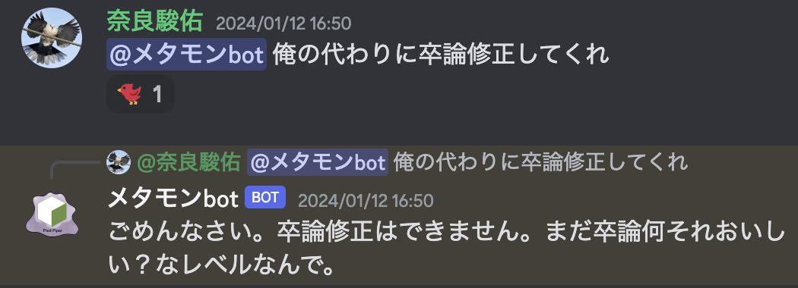

# metamon bot
## TL;DR
discord内の特定ユーザーの発言を学習し、その人になり切って会話するbotです。

## 機能について
| スラッシュコマンド | 機能 |
| --- | --- |
| `help` | 本botについての説明を表示 |
| `henshin` | 予め保存されたユーザーについて、ユーザーネームを引数で指定して変身します |

## 使い方について
1. `/henshin`コマンドで変身します。
2. メンション(@メタモンbot)をつけてメッセージを送ります。
3. 返信が返ってきます！

## 参考資料
- [discord botを用意する方法について](https://qiita.com/1ntegrale9/items/cb285053f2fa5d0cccdf)
- [JavaScriptでdiscordを作る方法について](https://discordjs.guide/#before-you-begin)

